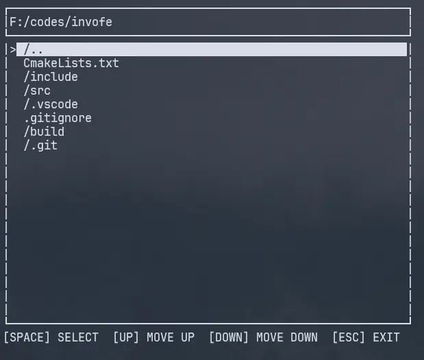
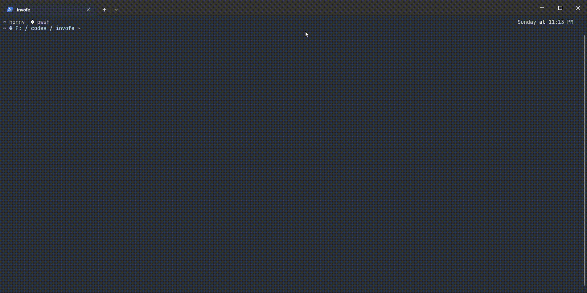

# InvoFE (in production)
A terminal based file explorer for Windows.
## Demo


## Features
- File navigation
- Display files
- and more to come!
## Build Project
1. Create a build folder at the project root directory
```shell
mkdir build
```
```shell
cd build
```
3. Generate CmakeFiles
```shell
cmake ..
```
5. Build
```shell
cmake --build .
```
7. Execute
```shell
.\Debug\InvoFE.exe
```
